# 🤖 Robot Shop on AWS EKS

> Deploy a production-style three-tier microservices e-commerce application on **Amazon EKS** using **Kubernetes, Helm, AWS Load Balancer Controller, and Amazon EBS CSI Driver**.


## 📖 Overview

This project demonstrates how to deploy Stan's Robot Shop on Amazon Elastic Kubernetes Service (EKS). It covers local testing with Docker Compose, provisioning an EKS cluster, configuring IAM OIDC, installing the AWS Load Balancer Controller and Amazon EBS CSI Driver, deploying the application with Helm, exposing it through an ALB-backed Ingress, verifying the deployment, and cleaning up AWS resources.

## 📑 Table of Contents

- [Overview](#-overview)
- [Features](#-features)
- [Architecture](#-architecture)
- [Tech Stack](#-tech-stack)
- [How the Application Works](#-how-the-application-works)
- [Prerequisites](#-prerequisites)
- [Local Deployment with Docker Compose](#-local-deployment-with-docker-compose)
- [Setting Up the Amazon EKS Cluster](#-setting-up-the-amazon-eks-cluster)
- [Deploying the Robot Shop Application](#-deploying-the-robot-shop-application-on-amazon-eks)
- [Verify the Application](#-verify-the-application)
- [Cleanup](#-step-7--clean-up-aws-resources)
- [Learning Outcomes](#-learning-outcomes)
- [Conclusion](#-conclusion)

---

## 🚀 Features

- Amazon EKS deployment
- Kubernetes Deployments & StatefulSets
- Helm-based installation
- AWS ALB Ingress
- Amazon EBS persistent volumes
- MongoDB, MySQL, Redis, RabbitMQ
- Production-style microservices
- Local Docker Compose testing

---

## 🏗 Architecture

```text
Internet
   │
AWS Application Load Balancer
   │
Kubernetes Ingress
   │
Frontend (Web)
   │
Microservices
 ├─ User
 ├─ Catalogue
 ├─ Cart
 ├─ Shipping
 ├─ Payment
 ├─ Ratings
 └─ Dispatch
   │
Databases
 ├─ MongoDB
 ├─ MySQL
 ├─ Redis
 └─ RabbitMQ
```
---

<p align="center">
  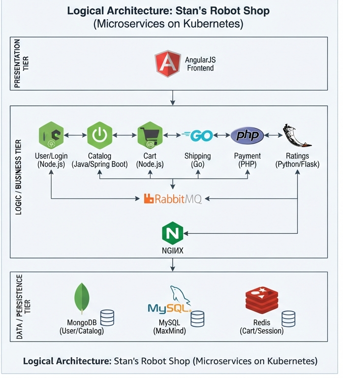
</p>

--- 

## 🛠 Tech Stack

| Category | Technology |
|---|---|
| Cloud Platform | Amazon Web Services (AWS) |
| Orchestration | Kubernetes, Amazon EKS |
| Containerization | Docker |
| Package Manager | Helm |
| Ingress | AWS Load Balancer Controller |
| Storage | Amazon EBS CSI Driver |
| Frontend | AngularJS |
| Backend | Node.js, Java, Go, Python, PHP |
| Databases | MongoDB, MySQL, Redis |
| Messaging | RabbitMQ |

---

## 🛒 How the Application Works

Stan's **Robot Shop** simulates the workflow of a real-world e-commerce platform by using a collection of independent microservices that work together to provide a seamless shopping experience.

### 🏠 1. Homepage
Users access the Robot Shop application through the web interface, which serves as the entry point to the platform.

### 👤 2. User Registration & Authentication
New users can create an account, while existing users can securely log in to access personalized features such as shopping carts and order history.

### 📦 3. Product Catalog
The **Catalogue Service** retrieves robot product information from the database and displays available products, including descriptions, images, and prices.

### 🛒 4. Shopping Cart
Users can add, update, or remove products from their shopping cart. Cart data is temporarily stored in **Redis** for fast access and improved performance.

### 💳 5. Checkout & Payment
Once the cart is finalized, users proceed to checkout. The **Payment Service** validates the transaction, processes the payment, and generates an order confirmation.

### 🚚 6. Shipping & Dispatch
After a successful payment, the **Shipping** and **Dispatch** services coordinate order fulfillment and delivery processing.

### 📄 7. Order Completion
The application generates a unique **Order ID**, confirming that the purchase has been successfully completed.

---

<p align="center">
  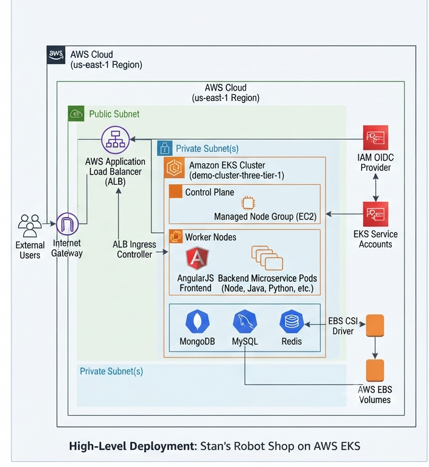
</p>

---

## 📋 Prerequisites

Ensure the following tools are installed and configured on your machine before beginning:

* **Docker:** For building and testing images locally.
* **AWS CLI:** Configured with appropriate permissions.
* **eksctl:** For EKS cluster lifecycle management.
* **Helm:** For package management and application deployment.
* **kubectl:** To interact with the Kubernetes cluster.

---

## 🐳 Local Deployment with Docker Compose

Before deploying the application to **Amazon EKS**, it is recommended to test the application locally. This ensures that all microservices are functioning correctly before moving to the cloud.

---

## 📥 Step 1: Clone the Repository

Clone the repository from GitHub and navigate to the project directory.

```bash
git clone https://github.com/iam-veeramalla/three-tier-architecture-demo.git

cd three-tier-architecture-demo
```


## 📦 Step 2: Pull Docker Images

Download all required Docker images from Docker Hub.

```bash
docker-compose pull
```
---

<p align="center">
  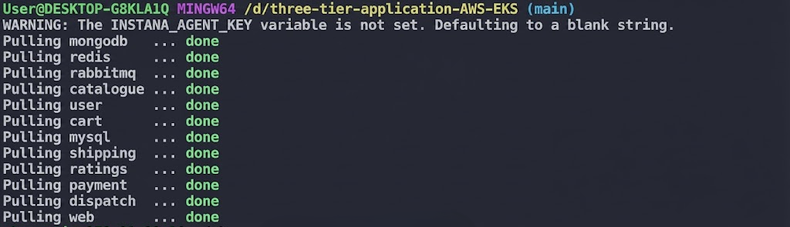
</p>


## 🚀 Step 3: Start the Application

Start all containers using Docker Compose.

```bash
docker compose up -d
```


## 🔍 Step 4: Verify Running Containers

Ensure all containers are running successfully.

```bash
docker ps
```

## 🌐 Step 5: Access the Application

Open your browser and navigate to:

```
http://localhost:8080
```

---

<p align="center">
  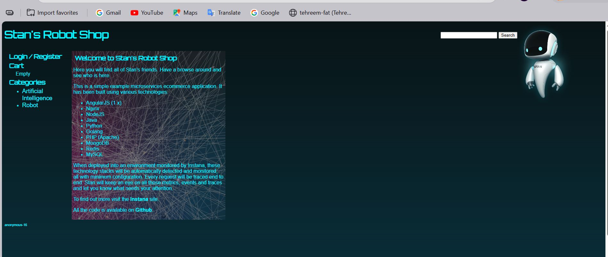
</p>

<p align="center">
  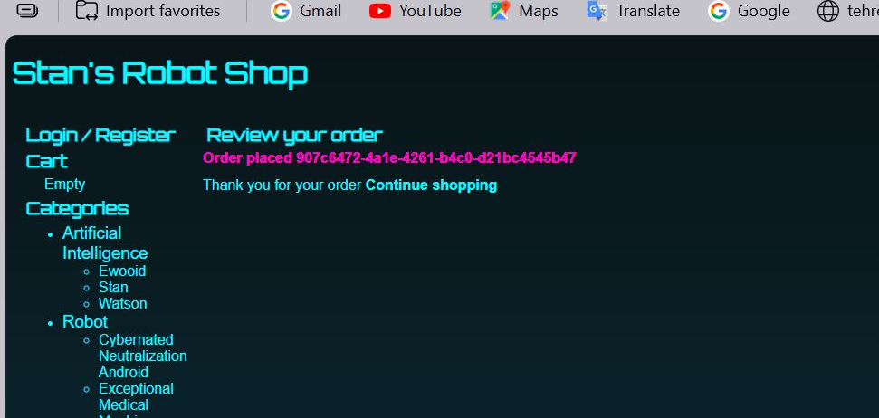
</p>

<p align="center">
  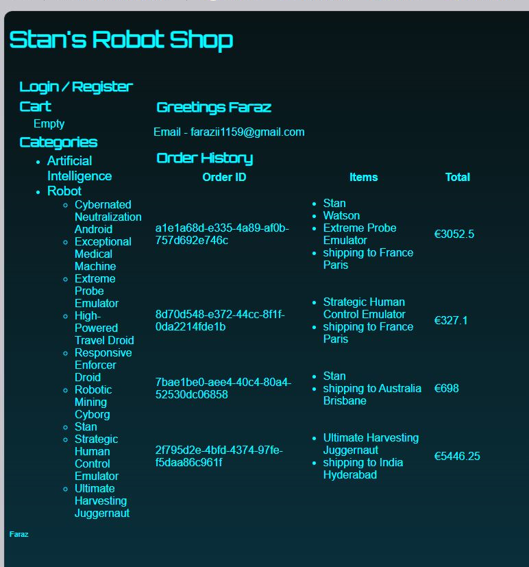
</p>

If everything is working correctly, the **Robot Shop** homepage should load successfully.

---

## 🧹 Remove Containers and Volume

To completely clean up the local environment:

```bash
docker compose down -v
```

---

## ☁️ Setting Up the Amazon EKS Cluster
Now that we've tested the application locally, it’s time to deploy it on a fully managed Kubernetes cluster using Amazon EKS.

## 🔧 Step 1: Create the EKS Cluster
We'll start by creating an EKS cluster using eksctl. This tool simplifies EKS cluster creation and management.

```bash
eksctl create cluster 
--name demo-cluster-three-tier-1 
--region us-east-1
```

This command provisions an Amazon EKS cluster named `demo-cluster-three-tier-1` in the `us-east-1` (N. Virginia) region.
> **Note:** Cluster creation typically takes **10–15 minutes**, depending on your AWS account and region.

---

<p align="center">
  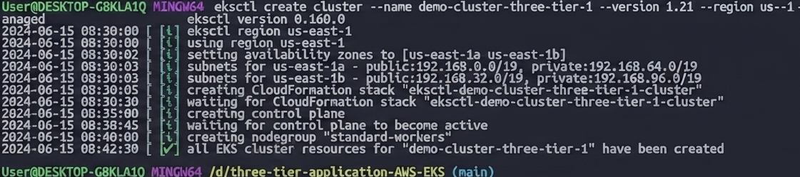
</p>


### Verify the Cluster

After the cluster has been created successfully, verify its status.

```bash
kubectl get nodes
```
---

## 🔐 Step 2: Configure IAM OIDC Provider
Amazon EKS uses an IAM OIDC provider to enable IAM Roles for Service Accounts (IRSA). This allows Kubernetes service accounts to securely access AWS services without storing long-term AWS credentials.


### Export the Cluster Name

```bash
export cluster_name=demo-cluster-three-tier-1
```

---

### Retrieve the Cluster OIDC ID

```bash
oidc_id=$(aws eks describe-cluster --name $cluster_name --query "cluster.identity.oidc.issuer" --output text | cut -d '/' -f 5)
```

---

### Verify Whether an OIDC Provider Already Exists

Before creating a new provider, check whether one is already associated with the cluster.

```bash
aws iam list-open-id-connect-providers | grep $oidc_id | cut -d "/" -f4
```

If the command returns the OIDC ID, the provider is already configured and you can proceed to the next step.

If the command returns no output, associate the IAM OIDC provider using the following command.

---

### Associate the IAM OIDC Provider

```bash
eksctl utils associate-iam-oidc-provider 
--cluster $cluster_name 
--approve

```
---

<p align="center">
  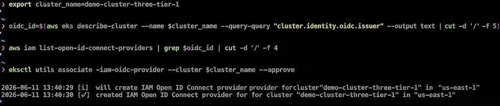
</p>

---

## 🌐 Step 3: Install the AWS Load Balancer Controller

The **AWS Load Balancer Controller** automatically provision and manage **AWS Application Load Balancers (ALBs)** for Kubernetes **Ingress** resources , enabling external HTTP/HTTPS traffic to reach services running inside the EKS cluster.

This controller is an essential component for running production workloads on Amazon EKS.

### Download the IAM Policy

Download the IAM policy required by the AWS Load Balancer Controller.

```bash
curl -O https://raw.githubusercontent.com/kubernetes-sigs/aws-load-balancer-controller/v2.11.0/docs/install/iam_policy.json
```

This policy contains the AWS permissions required to create and manage Application Load Balancers and related AWS networking resources.

---

### Create the IAM Policy

Create the IAM policy in your AWS account.

```bash
aws iam create-policy \
--policy-name AWSLoadBalancerControllerIAMPolicy \
--policy-document file://iam_policy.json
```

After execution, AWS returns the ARN of the newly created IAM policy.

Save the policy ARN, as it will be required when creating the IAM service account.

---


### Create the IAM Service Account

Create an IAM Service Account for the AWS Load Balancer Controller.

> **Replace `<AWS_ACCOUNT_ID>` with your AWS Account ID.**

```bash
eksctl create iamserviceaccount \
--cluster=demo-cluster-three-tier-1 \
--namespace=kube-system \  
--name=aws-load-balancer-controller \
--role-name AmazonEKSLoadBalancerControllerRole \
--attach-policy-arn=arn:aws:iam:: <AWS_ACCOUNT_ID>:policy/AWSLoadBalancerControllerIAMPolicy \
--approve
```

---

<p align="center">
  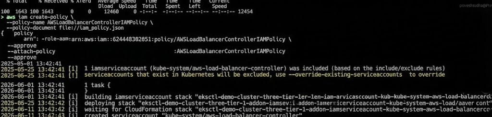
</p>

---

### Verify the Service Account

Verify that the service account has been created successfully.

```bash
kubectl get serviceaccount -n kube-system
```

You should see:

```text
aws-load-balancer-controller
```

---

## 📥 Add the Helm Repository

The AWS Load Balancer Controller is distributed as a Helm chart. First, add the official AWS EKS Helm repository and update the local repository index.

```bash
helm repo add eks https://aws.github.io/eks-charts

helm repo update eks
```

---

> **Note:** Ensure that your AWS CLI is authenticated and the current IAM user or role has sufficient permissions to create IAM roles, policies, and EKS add-ons.

### Install the AWS Load Balancer Controller

Install the controller into the **kube-system** namespace using Helm.

> **Before running the command, replace `<YOUR_VPC_ID>` with the VPC ID where your EKS cluster is deployed.**

```bash
helm install aws-load-balancer-controller eks/aws-load-balancer-controller -n kube-system \
--set clusterName=demo-cluster-three-tier-1 \
--set serviceAccount.create=false \
--set serviceAccount.name=aws-load-balancer-controller \
--set region=us-east-1 \
--set vpcId=<YOUR_VPC_ID>
```

---

### Verify the Deployment

After the installation completes, verify that the deployment is running.

```bash
kubectl get deployment -n kube-system aws-load-balancer-controller
```

---

<p align="center">
  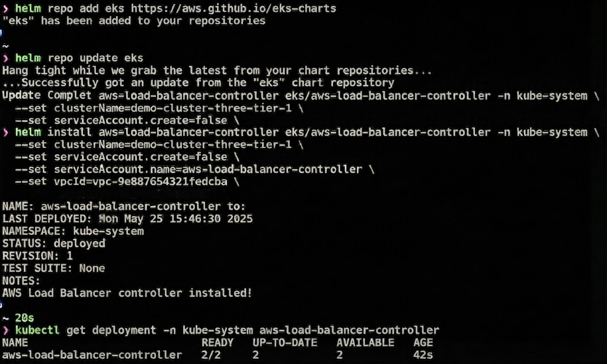
</p>

---

You can also verify the running pods.

```bash
kubectl get pods -n kube-system
```

The deployment is successful when all controller Pods are in the `Running` state.

---

## 💾 Step 4: Configure the Amazon EBS CSI Driver

Many applications require **persistent storage** to retain data even if Pods are restarted or rescheduled.

In Robot Shop, the following stateful services require persistent storage:

- MongoDB
- MySQL
- Redis

Amazon EKS provides persistent storage through the **Amazon EBS CSI (Container Storage Interface) Driver**, which dynamically provisions Amazon EBS volumes for Kubernetes Persistent Volume Claims (PVCs).

Without the EBS CSI Driver, StatefulSets cannot automatically create or attach persistent storage volumes.

---

### Create the IAM Role for the Amazon EBS CSI Driver

Create an IAM Service Account with the required permissions.

```bash
eksctl create iamserviceaccount \
--name ebs-csi-controller-sa \
--namespace kube-system \
--cluster demo-cluster-three-tier-1 \
--role-name AmazonEKS_EBS_CSI_DriverRole \
--role-only \
--attach-policy-arn arn:aws:iam::aws:policy/service-role/AmazonEBSCSIDriverPolicy \
--approve
```

---

### Install the Amazon EBS CSI Add-on

> **Replace `<AWS_ACCOUNT_ID>` with your AWS Account ID before running the command.**

```bash
eksctl create addon \
--name aws-ebs-csi-driver \
--cluster demo-cluster-three-tier-1 \
--service-account-role-arn arn:aws:iam::<AWS_ACCOUNT_ID>:role/AmazonEKS_EBS_CSI_DriverRole \
--force
```

---
<p align="center">
  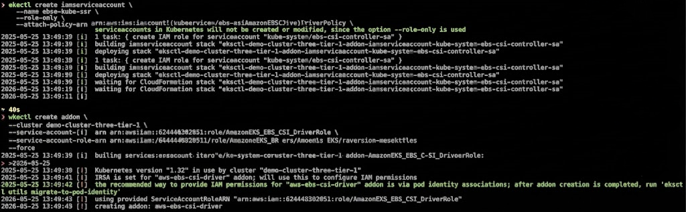
</p>

---

### Verify the Installation

Verify that the CSI Driver pods are running.

```bash
kubectl get pods -n kube-system
```

The installation is complete when the EBS CSI controller and node Pods are in the `Running` state.

You can also verify the installed add-on.

```bash
eksctl get addon --cluster demo-cluster-three-tier-1
```

---

## 🚀 Deploying the Robot Shop Application on Amazon EKS

With the infrastructure successfully configured, the next step is to deploy the Robot Shop application using **Helm**, the package manager for Kubernetes.

The Helm chart contains all Kubernetes manifests required to deploy the complete application, including Deployments, StatefulSets, Services, ConfigMaps, Persistent Volume Claims, and Ingress resources.

### Step 5: Navigate to the Helm Chart Directory

Navigate to the Helm directory inside the cloned repository.

```bash
cd three-tier-architecture-demo/EKS/helm
```

### Create a Dedicated Namespace

```bash
kubectl create namespace robot-shop
```

---

### Deploy the Application Using Helm

Install the Helm chart.

```bash
helm install robot-shop . \  
  --namespace robot-shop
```

---

### Verify the Deployment

Verify that all Pods are running successfully.

```bash
kubectl get pods -n robot-shop
```

Verify that the Kubernetes Services have been created successfully.

```bash
kubectl get svc -n robot-shop
```

All resources should eventually reach the **Running** or **Ready** state.

---

## 🌐 Step 6: Expose the Application Using Ingress

The Robot Shop application must be accessible from outside the Kubernetes cluster.

Apply the Ingress resource.

```bash
kubectl apply -f ingress.yaml
```

The AWS Load Balancer Controller automatically provisions an Application Load Balancer (ALB) for the Ingress resource.

### Verify the Ingress

```bash
kubectl get ingress -n robot-shop
```
---

### Wait for the Load Balancer

> Provisioning the AWS Application Load Balancer typically takes **5–10 minutes**.

You can monitor its status using:

- AWS Management Console
- EC2 Dashboard
- Load Balancers

Once the ALB status changes to **Active**, copy its **DNS Name**.

Open the ALB DNS name in your web browser.

If the deployment was successful, the **Robot Shop** application homepage should be displayed.

---

## ✅ Functional Verification

Perform a quick functionality test to ensure that all services are working correctly.

- Register a new user
- Log in to the application
- Browse the product catalog
- Add products to the shopping cart
- Proceed to checkout
- Complete an order successfully

Successful completion of these steps confirms that the microservices are communicating correctly and that the application has been deployed successfully on Amazon EKS.

---

## 🧹 Step 7 – Clean Up AWS Resources

To avoid unnecessary AWS charges, delete all resources created during this project after testing is complete.


```bash
eksctl delete cluster \
 --name demo-cluster-three-tier-1 \
 --region us-east-1
```

This command deletes the EKS cluster and all associated AWS resources to help avoid unnecessary charges.

> **Note:** Cluster deletion typically takes **10–20 minutes**, depending on the resources provisioned.

---

## 🎯 Learning Outcomes

By completing this project, you gain hands-on experience with several production-grade DevOps technologies and cloud-native concepts, including:

- Amazon Elastic Kubernetes Service (EKS)
- Kubernetes Architecture
- Helm Package Management
- Kubernetes Deployments and StatefulSets
- Kubernetes Services and Ingress
- AWS Load Balancer Controller
- Amazon EBS CSI Driver
- IAM Roles for Service Accounts (IRSA)
- Persistent Storage Management
- Microservices Deployment
- Cloud Networking
- Production-style Application Deployment
- Kubernetes Troubleshooting
- Infrastructure Automation

---

## 📝 Conclusion

This project demonstrates how to deploy a production-ready microservices application on **Amazon Elastic Kubernetes Service (EKS)** using **Kubernetes**, **Helm**, the **AWS Load Balancer Controller**, and the **Amazon EBS CSI Driver**.

By completing this project, you gain hands-on experience with Kubernetes orchestration, cloud-native application deployment, persistent storage, networking, and AWS infrastructure. It serves as a practical, production-style deployment example and is a valuable addition to any **DevOps** or **Cloud Engineering** portfolio.

---

## 👨‍💻 Author

**Faraz Shabbir**

- GitHub: https://github.com/farazii1159
- LinkedIn: https://linkedin.com/in/your-linkedin


